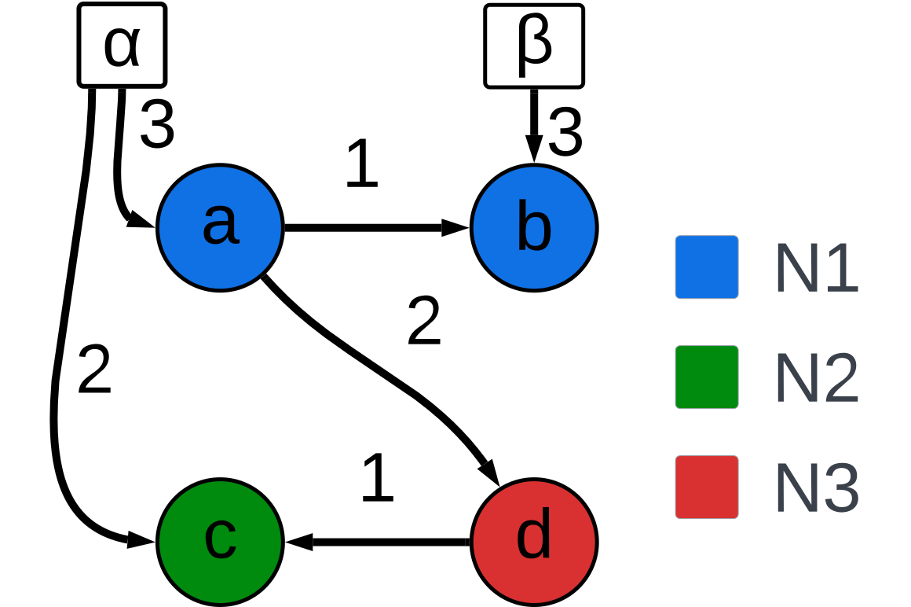

.. DO NOT EDIT.
.. THIS FILE WAS AUTOMATICALLY GENERATED BY SPHINX-GALLERY.
.. TO MAKE CHANGES, EDIT THE SOURCE PYTHON FILE:
.. "auto_examples/create_network.py"
.. LINE NUMBERS ARE GIVEN BELOW.

.. only:: html

    .. note::
        :class: sphx-glr-download-link-note

        :ref:`Go to the end <sphx_glr_download_auto_examples_create_network.py>`
        to download the full example code.

.. rst-class:: sphx-glr-example-title

.. _sphx_glr_auto_examples_create_network.py:

Creating a Network
==================

This example walks through how to create a simple network and run it in the software simulator

.. GENERATED FROM PYTHON SOURCE LINES 14-17

Importing the necessary libraries
---------------------------------
First import the CRI network class from the the hs_api library and import the leaky integrate and fire neuron model from the neuron models collection.

.. GENERATED FROM PYTHON SOURCE LINES 17-21

.. code-block:: Python

    from hs_api.api import CRI_network
    from hs_api.neuron_models import LIF_neuron

.. GENERATED FROM PYTHON SOURCE LINES 22-32

Defining a neuron model
------------------------
HiAER-Spike supports specifying different models for different neurons. A set of model classes are provided. Currently only variants of the integrate and fire and memoryless integrate and fire model provided by the LIF_neuron class and ANN_neuron class respectively are supported
LIF_neuron models have 3 parameters

 * theta(:math:`\theta`): determines the membrane potential at which the neuron spikes and the potential is reset to zero
 * nu(:math:`\nu`): controls the magnitude of random noise added to the membrane potential at each step.
 * lambda(:math:`\lambda`): controls the voltage leakage that occurs during each timestep. :math:`v=v-v/2^{leak}`

Neurons a and b belong to neuron model N1, neuron c belongs to neuron model N2, and neuron d belongs to neuron model N3.

.. GENERATED FROM PYTHON SOURCE LINES 32-37

.. code-block:: Python

    N1 = LIF_neuron(theta = 3, nu = -17, Lambda = (2**6)-1)
    N2 = LIF_neuron(theta = 4, nu = -17, Lambda = 2)
    N3 = ANN_neuron(theta = 5, nu = 2)

.. GENERATED FROM PYTHON SOURCE LINES 38-41

Defining the axons dictionary
-----------------------------
Axons represent incoming synapses to the network. Each axon has one or more postsynaptic neurons. Users can manually send spikes over axons at each timestep

.. GENERATED FROM PYTHON SOURCE LINES 41-44

.. code-block:: Python

    axons = {'alpha': [('a', 3),('c', 2)],
                'beta': [('b', 3)]}

.. GENERATED FROM PYTHON SOURCE LINES 45-48

Defining the neurons dictionary
-------------------------------
The neurons dictionary defines the neurons in the network and the synapses between them. Each neuron may have synapses to zero, one, or many postsynaptic neurons and must have a model specified by providing a neuron model object. Keys in the connections and axons dictionaries must be mutually exclusive

.. GENERATED FROM PYTHON SOURCE LINES 48-54

.. code-block:: Python

    neurons = {'a': ([('b', 1), ('d', 2)], N1),
               'b': ([], N1),
               'c': ([], N2),
               'd': ([('c', 1)], N3)}

.. GENERATED FROM PYTHON SOURCE LINES 55-58

Defining the outputs List
-------------------------
The outputs list defines the neurons in the network that the user wishes to monitor for spikes. Each element in the list is the key of a neuron in the connections dicitonary

.. GENERATED FROM PYTHON SOURCE LINES 58-61

.. code-block:: Python

    outputs = ['a', 'b']

.. GENERATED FROM PYTHON SOURCE LINES 62-65

Initializing a Network
----------------------
A CRI network object must be contructed using the prevoisly defined dictionaries and list.

.. GENERATED FROM PYTHON SOURCE LINES 65-68

.. code-block:: Python

    network = CRI_network(axons=axons,connections=connections,outputs=outputs)

.. GENERATED FROM PYTHON SOURCE LINES 69-72

Running a timestep
----------------------
The step method executes a single timestep of the network. Inputs may be provided for each timestep in the form of a list of axons to send spikes over dat the given timestep. A list of spikes is always returned. Optionally the membrane potential parameter can be set to true to return membrane potentials for all neurons in the network.

.. GENERATED FROM PYTHON SOURCE LINES 72-79

.. code-block:: Python

    inputs = ['alpha','beta']
    currSpikes = network.step(inputs)
    # Alternative
    # potentials, currSpikes = network.step(inputs, membranePotential=True)
    print(currSpikes)

.. GENERATED FROM PYTHON SOURCE LINES 80-83

Updating Synapses
----------------------
Network topologies are frozen at object creation, but the weights of existing synapses may be altered.

.. GENERATED FROM PYTHON SOURCE LINES 83-86

.. code-block:: Python

    currWeight = network.read_synapse('a', 'b')
    network.write_synapse('a', 'b', 2)

.. _sphx_glr_download_auto_examples_create_network.py:

.. only:: html

  .. container:: sphx-glr-footer sphx-glr-footer-example

    .. container:: sphx-glr-download sphx-glr-download-jupyter

      :download:`Download Jupyter notebook: create_network.ipynb <create_network.ipynb>`

    .. container:: sphx-glr-download sphx-glr-download-python

      :download:`Download Python source code: create_network.py <create_network.py>`

    .. container:: sphx-glr-download sphx-glr-download-zip

      :download:`Download zipped: create_network.zip <create_network.zip>`

.. only:: html

 .. rst-class:: sphx-glr-signature

    `Gallery generated by Sphinx-Gallery <https://sphinx-gallery.github.io>`_
