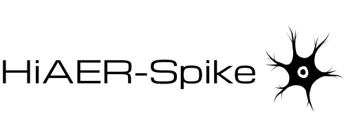

.. hiaerspike-web documentation master file, created by
   sphinx-quickstart on Mon Apr 21 13:00:42 2025.
   You can adapt this file completely to your liking, but it should at least
   contain the root `toctree` directive.

:html_theme.sidebar_secondary.remove:

.. LOGO

.. rst-class:: h4 text-center font-weight-light my-4

   This project aims to make massive scale simulations of spiking neural networks easily accessible to the research community, and in particular researches interested in neuromorphic computing for artificial intelligence and neuroscience researchers.

.. rst-class:: h4 text-center font-weight-light my-4

Key Features
============

.. grid:: 1 1 2 2
   :gutter: 5

   .. grid-item-card::
      :shadow: none
      :class-card: sd-border-0

      .. image:: _static/chip-tile.svg
         :class: no-bg only-dark

      .. image:: _static/chip-tile-light.svg
         :class: no-bg only-light
                 
      .. raw:: html

         
<strong>FPGA Based</strong> 
         Built using off the shelf reconfigurable hardware.

   .. grid-item-card::
      :shadow: none
      :class-card: sd-border-0

      .. image:: _static/neuron-tile.svg
         :class: no-bg only-dark

      .. image:: _static/neuron-tile-light.svg
         :class: no-bg only-light

      .. raw:: html

         
<strong>Large Networks</strong> 
         Capable of running up to 163 million neurons and 40 billion synapses.

   .. grid-item-card::
      :shadow: none
      :class-card: sd-border-0

      .. image:: _static/scale-tile.svg
         :class: no-bg only-dark

      .. image:: _static/scale-tile-light.svg
         :class: no-bg only-light

      .. raw:: html

         
<strong>Scalable Architecture</strong> 
         Hierarchical system architecture allows the system to be easily scaled.

   .. grid-item-card::
      :shadow: none
      :class-card: sd-border-0

      .. image:: _static/community-tile.svg
         :class: no-bg only-dark

      .. image:: _static/community-tile-light.svg
         :class: no-bg only-light

      .. raw:: html

         
<strong>Publically Available</strong> 
         Freely available for anyone to use over a web portal via the Neuroscience Gateway.

.. rst-class:: h4 text-center font-weight-light my-4

Funders
=======

.. grid:: 1 3 3 3

   .. grid-item::
      .. image:: _static/nsf-logo.png
         :target: https://www.nsf.gov/
         :class: no-bg

   .. grid-item::
      .. image:: _static/onr-logo.png
         :target: https://www.onr.navy.mil/
         :class: no-bg

   .. grid-item::
      .. image:: _static/wd-logo.png
         :target: https://www.westerndigital.com/
         :class: no-bg

.. toctree::
   :hidden:
   :maxdepth: 2

   About<about>
   Getting Started<getting_started>
   Examples<auto_examples/index>
   Publications<publications>
   Hardware Docs<hardware_docs/index>
