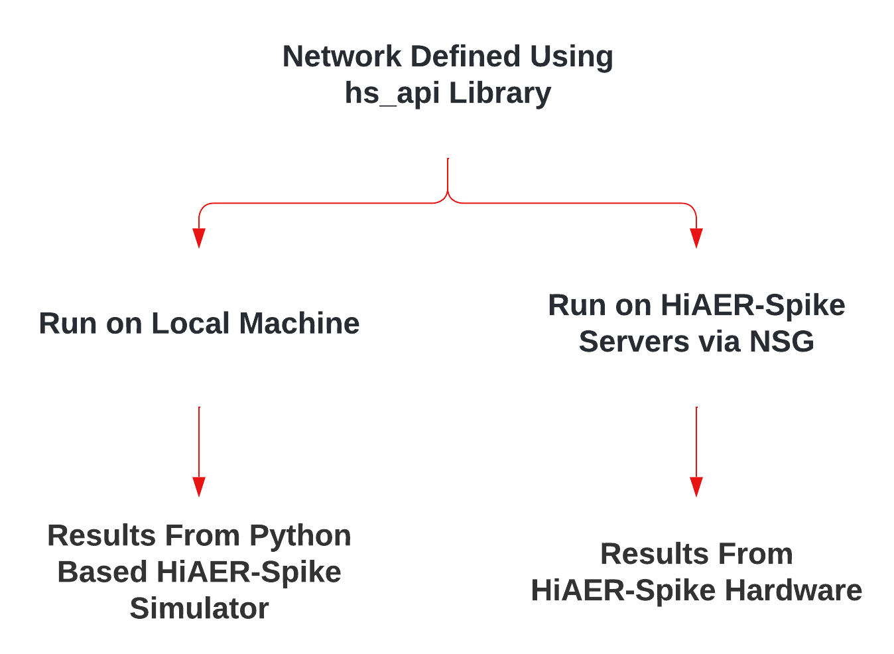
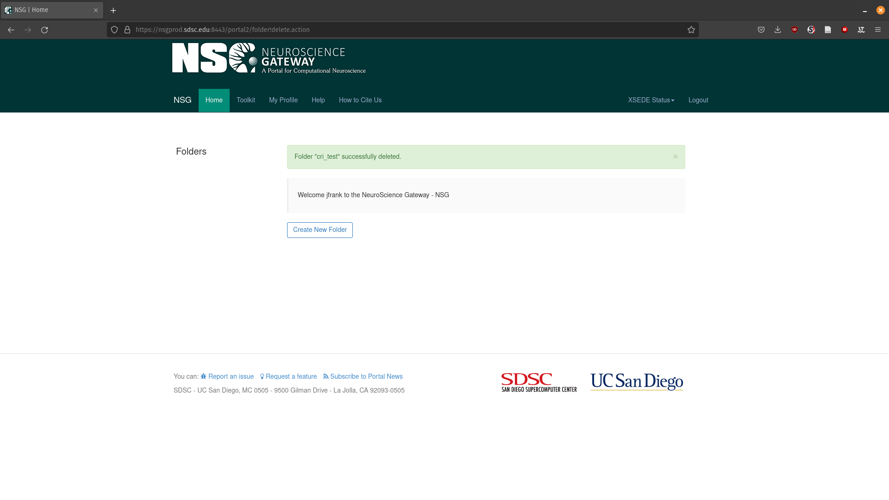
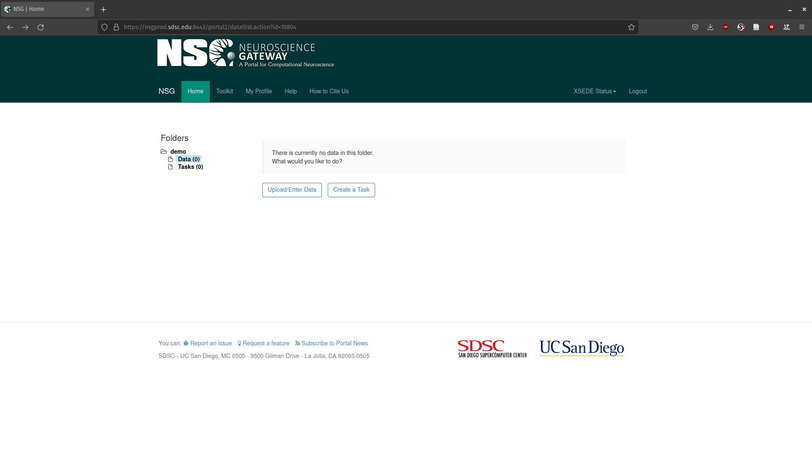
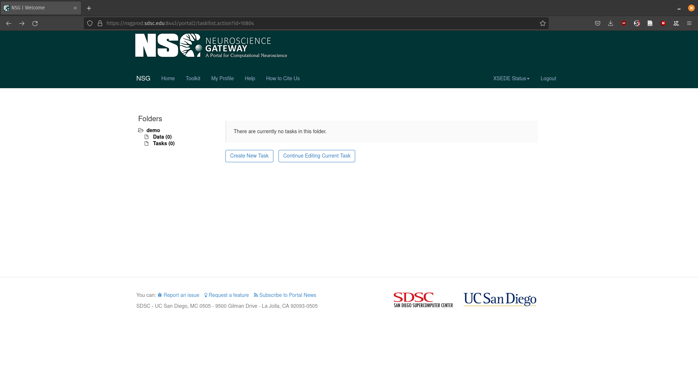
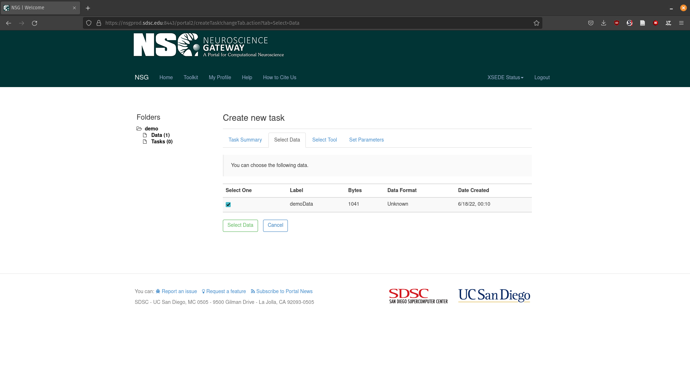
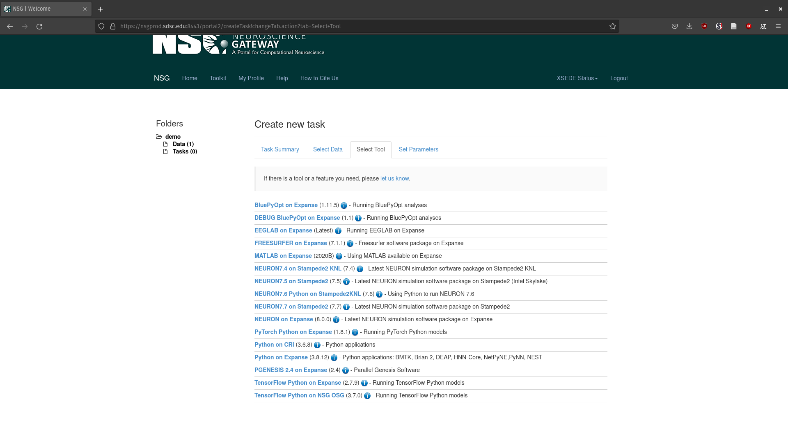
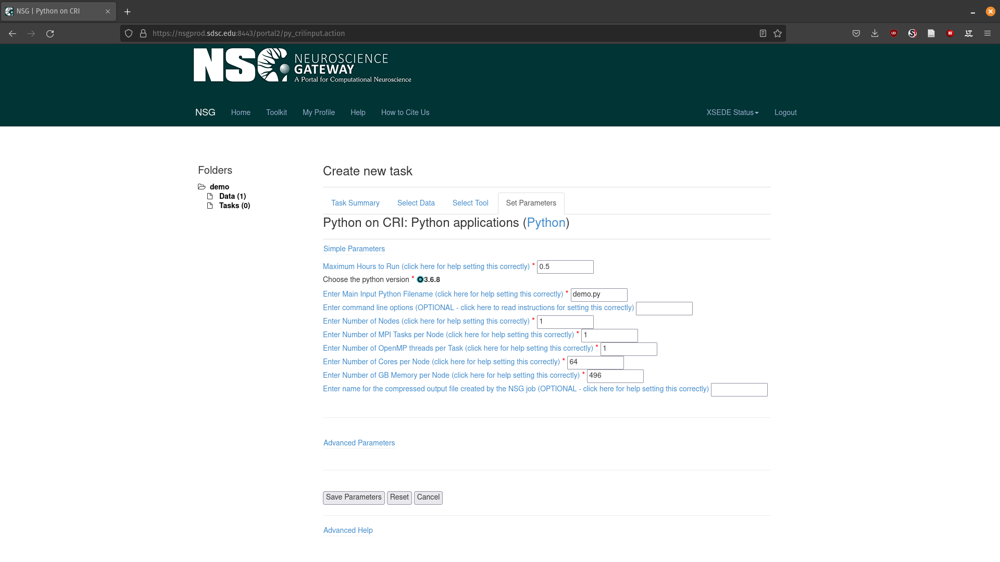
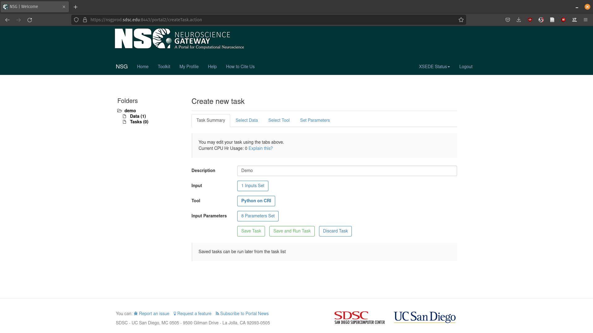
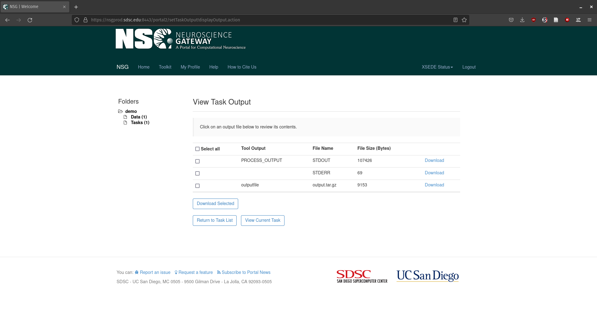

.. _nsg-run:

Running on NSG
==============================

Jobs can be debugged and simulated on a users work station using the provided simulator, then once ready can be run on the HiAER-Spike hardware by submitting a job over the `Neuroscience Gateway`_. (NSG). Users can register for an account `here`_.

.. _here: https://nsgprod.sdsc.edu:8443/portal2/login!input.action
.. _Neuroscience Gateway: https://www.nsgportal.org/

Creating Job Data
-----------------

Place your Python script in a folder and zip it

Create a Folder
---------------

Create a task folder if there is none listed on the upper left. Task folders are a place to hold related jobs

Upload Data
-----------

* Click on **Data** on the upper left
* Click **Upload/Enter Data**
* Upload the zip containing your Python script

Create a Task
-------------

* Click **Tasks** on the upper left
* Click **Create New Task**

Select Data
-----------

* Click **Select Input Data**
* Select the zip file you previously uploaded

Select the tool
---------------

* Click **Select Tool**
* Click **Python on CRI**

Select Parameters
-----------------

* Click **8 Parameters Set**
* Make sure **Enter Main Input Python Filename** corresponds with the name of your python script
* Set the other parameters appropriately
* Click **Save Parameters**

Run Task
--------

* Click **Save and Run**
* Click **OK** on the popup
* Your job has been submitted and you'll get an email when your job is complete!

Downloading Data
----------------

Once your job is complete you can download the resulting data

* Click on your tasks name under the **Label** column
* Click **output**
* Download **output.tar.gz**

